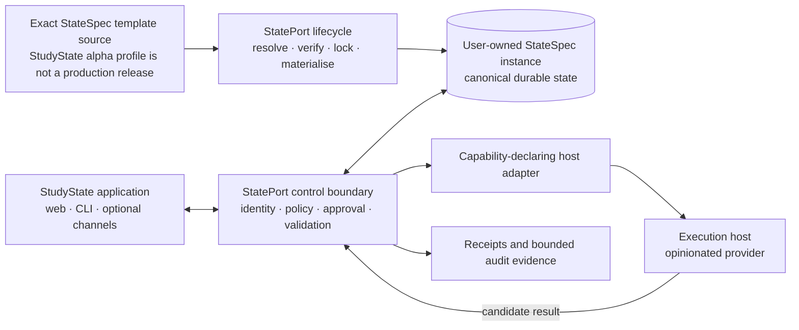

# StatePort architecture overview

This is the short, maintainable map of the local product path. The
[full architecture](ARCHITECTURE.md) defines the detailed ownership, trust,
execution-provider, and lifecycle boundaries.

## Ownership in one page

- The external template source owns reusable domain content only after its
  exact identity and authority are resolved. An unresolved release is
  non-authoritative and non-installable; an exact development candidate is
  isolated-test evidence, not an implicit production source.
- The instance repository owns private, durable user state and explicit
  overrides. Chat history, generated context packs, runtime caches, and host
  sessions are not canonical truth.
- StatePort owns lifecycle resolution, effective permissions, approvals,
  validation, leases, audit, and acceptance. Templates may request
  capabilities but cannot grant themselves permissions.
- The execution host performs bounded work and returns a candidate result. It
  cannot override StatePort policy or declare its own result accepted.
- Application views are trusted declarative projections rendered by
  StatePort-owned components. Optional terminal, editor, orchestration, and
  benchmark controls appear only when declared and authorized.

## Current delivery boundary

The diagram is a component and ownership map, not a claim that every future
deployment shape is delivered. The repository currently validates a
Linux-first, loopback, local-single-user alpha. Hosted and multi-user operation,
unattended autonomy, provider equivalence, production qualification, canonical
StudyState release acceptance, and public release remain outside the proven
boundary. See [local-alpha limitations](LOCAL_ALPHA_LIMITATIONS.md).
